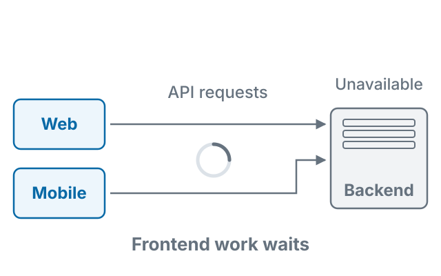
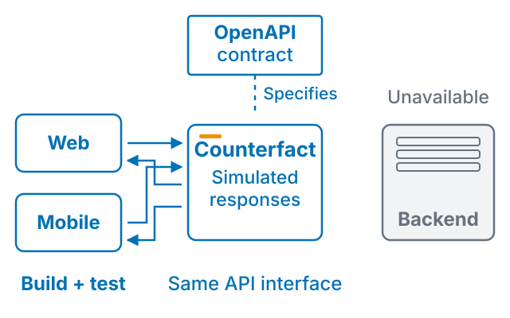
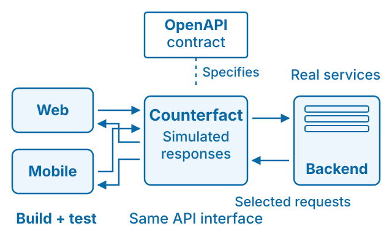

# Counterfact


## Build the frontend. Don’t wait for the backend.

Counterfact lets frontend developers work independently of the backend.
People and agents can build and test against an API contract instead of a live
API, simulating new functionality, error responses, and edge cases. Selectively
proxy requests to real services when they are useful.

### 1. The backend isn’t ready

Frontend work shouldn’t have to wait for the backend. When an API is unavailable or a feature hasn’t been built yet, developers still need a way to build and test the clients that depend on it.

<picture>
  <source media="(max-width: 480px)" srcset="./docs/images/counterfact-waiting-mobile.svg">
  
</picture>

### 2. Counterfact implements the contract

Give Counterfact an OpenAPI contract, and it provides a working API for your web and mobile clients. Develop against that contract, simulate new functionality, and test errors and edge cases without waiting for the live backend.

<picture>
  <source media="(max-width: 480px)" srcset="./docs/images/counterfact-simulation-mobile.svg">
  
</picture>

### 3. Mix simulated and real responses

<picture>
  <source media="(max-width: 480px)" srcset="./docs/images/counterfact-proxy-mobile.svg">
  
</picture>

The OpenAPI document describes the interface. Counterfact handles requests and
returns simulated responses or forwards selected requests to a real service.

## Try it

With Node.js 22 or newer, run this example in a new directory:

```sh
npx counterfact@latest https://petstore3.swagger.io/api/v3/openapi.json api
```

Counterfact creates editable routes and generated types in `api/`, then starts
a local API at `http://localhost:3100`. Try `http://localhost:3100/pet/1` or open
[Swagger UI](http://localhost:3100/counterfact/swagger/). Generated sample
responses are a starting point; customize the behavior your frontend needs.

Use your own OpenAPI document in place of the example URL.
For a repeatable project or CI workflow,
[install a pinned version](./packages/counterfact/docs/first-10-minutes.md#install-a-pinned-version)
and commit the lockfile.

## Keep going

- [Documentation](https://counterfact.dev/docs/getting-started) · [guides by task](./packages/counterfact/docs/usage.md) · [CLI and API reference](./packages/counterfact/docs/reference.md)
- [Custom responses](./packages/counterfact/docs/features/routes.md) · [errors and edge cases](./packages/counterfact/docs/patterns/simulate-failures.md) · [selective proxying](./packages/counterfact/docs/features/proxy.md)
- [Contributing](./CONTRIBUTING.md) · [issues](https://github.com/counterfact/api-simulator/issues) · [security](./SECURITY.md)
- [Website](https://counterfact.dev) · [npm package](https://www.npmjs.com/package/counterfact) · [changelog](./packages/counterfact/CHANGELOG.md) · [architecture decisions](./docs/adr/)

This is a Yarn workspace monorepo. The published application and canonical user
docs live in [`packages/counterfact`](./packages/counterfact/README.md).
Focused packages: [client](./packages/client/README.md),
[generator](./packages/generator/README.md), [OpenAPI](./packages/openapi/README.md),
[REPL](./packages/repl/README.md), [runtime](./packages/runtime/README.md), and
[types](./packages/types/README.md).

[MIT license](./License.md) · Copyright Patrick McElhaney.
